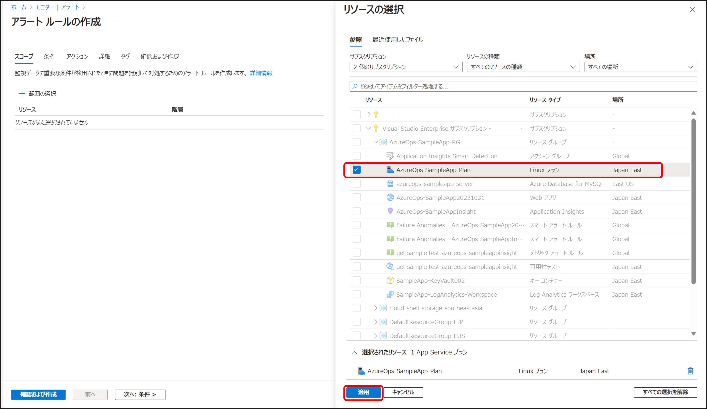
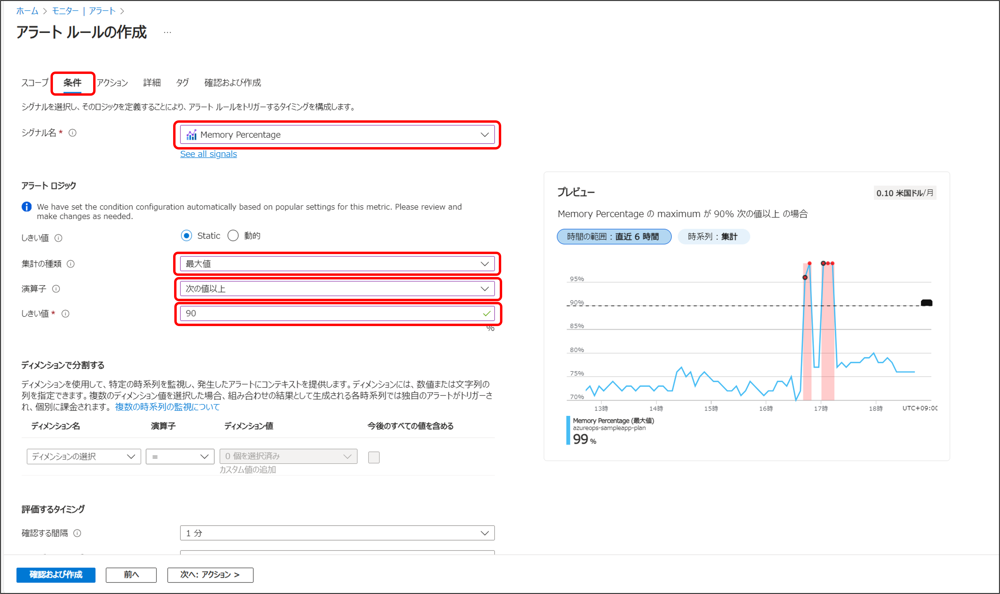
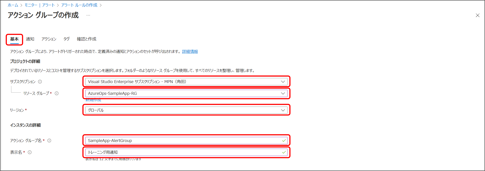
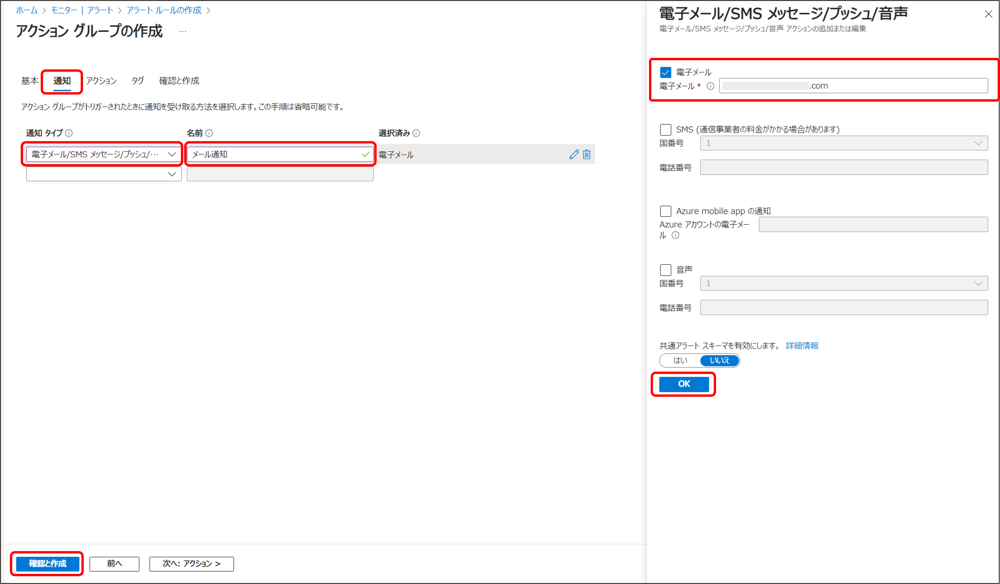
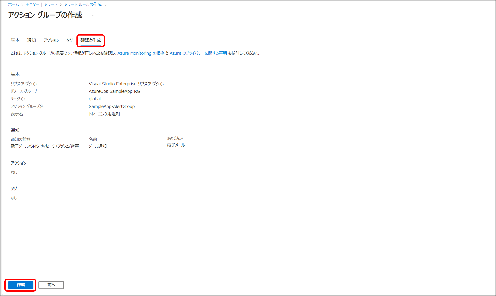
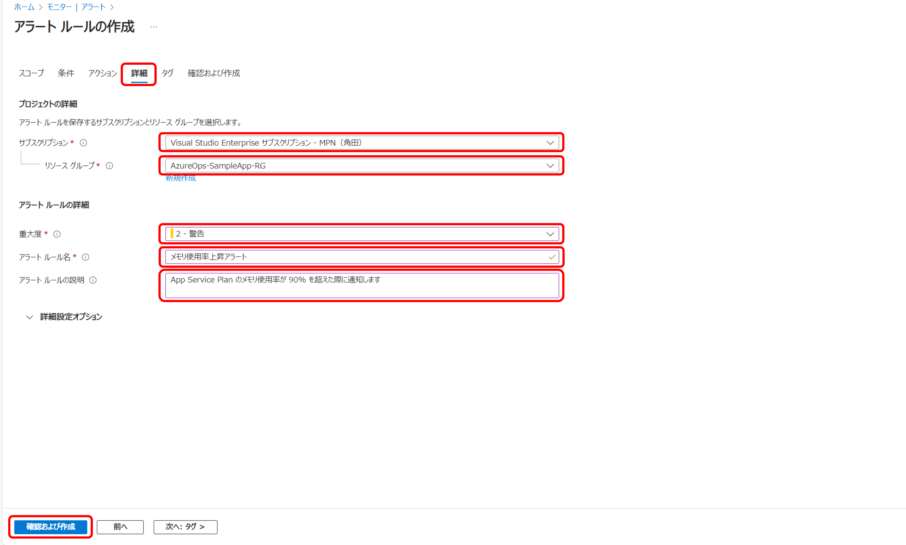
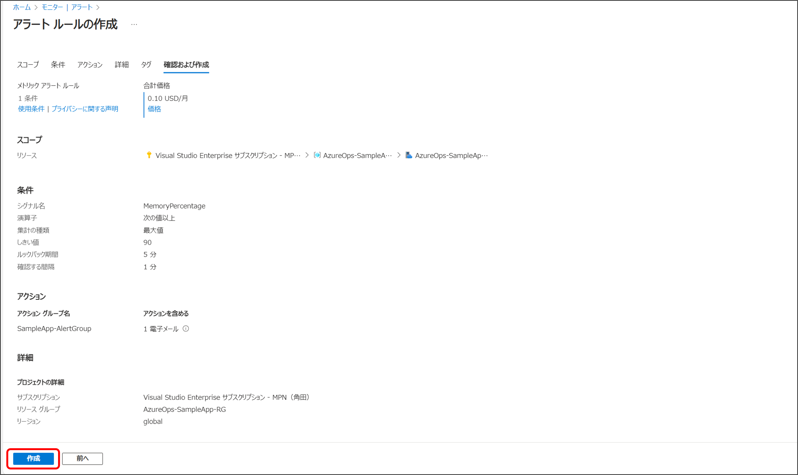
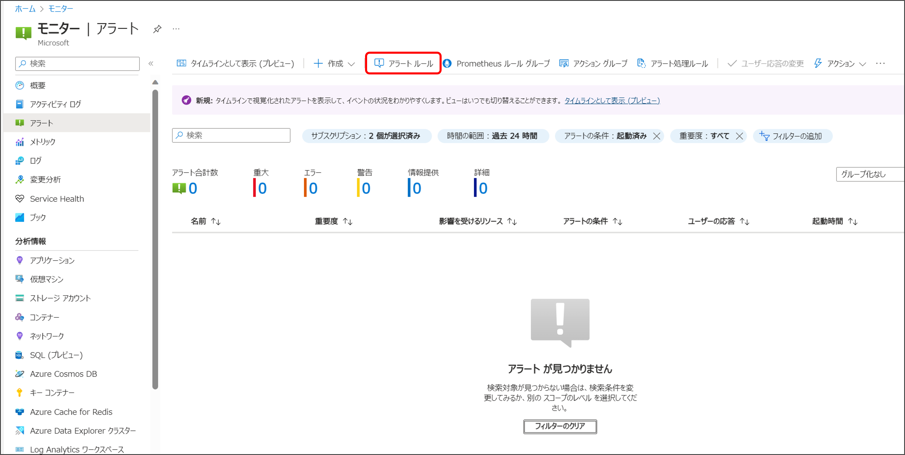
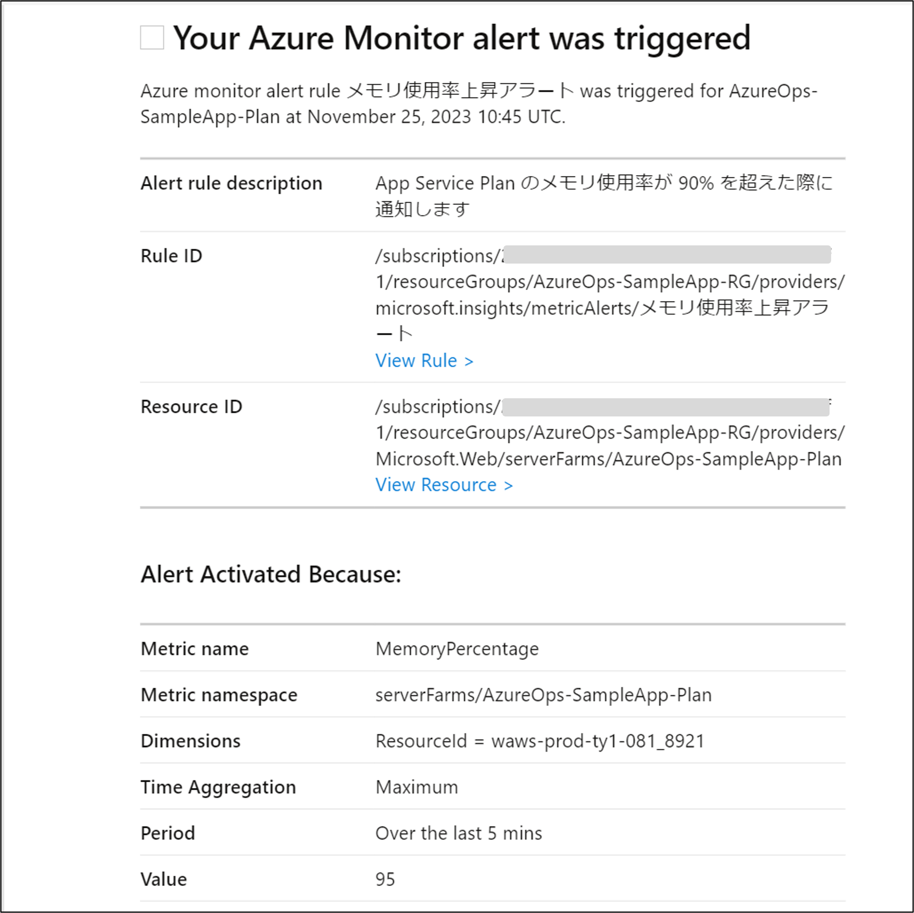
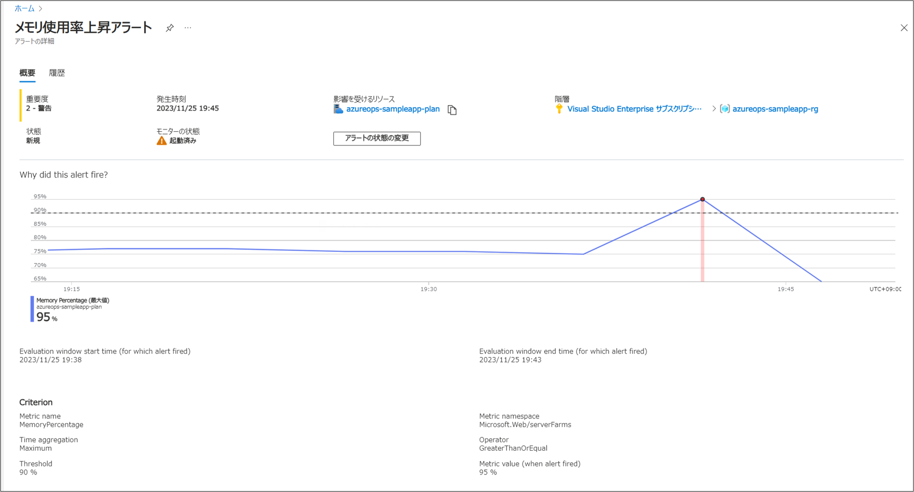

# パート６ : アラートを使用してメトリックの異常を通知する

## パートの概要
このパートでは、[Azure Monitor](https://learn.microsoft.com/ja-jp/azure/azure-monitor/overview) の機能の一つである [Azure Monitor メトリック](https://learn.microsoft.com/ja-jp/azure/azure-monitor/essentials/data-platform-metrics) を使用して、App Service の CPU使用率を観察する方法を学習します。  
また、同じく Azure Monitor の機能である [Azure Monitor アラート](https://learn.microsoft.com/ja-jp/azure/azure-monitor/alerts/alerts-overview) を使用して、メモリ使用率が閾値を超えた場合に通知を送信する方法を学習します。  
Azure Monitor メトリックは、監視対象のリソースから様々な数値データを収集します。  
Azure Monitor アラートは、そのメトリックやログのデータを使用して特定の条件に基づいてアラートをトリガーし、運用者に通知を送ります。  
これらの機能を組み合わせることで、運用者は効果的なモニタリングと管理を実現し、システムの信頼性と可用性を向上させることができます。

## ケース
サンプルのアプリケーションには予め、意図的にメモリ使用率を上昇させるリンクを設置しています。
メモリの最大使用率が 90% を超えた場合にアラートをトリガーするように設定し、実際に通知が届くことを確認します。  

※ トレーニングではインスタンス数を 1 に設定していますので通常の状態でも 70～80%程度のメモリ使用率となります。  
実際の運用では、インスタンス数を増やすことでメモリに余裕を持たせ、通知が届いてから対処するのに十分な時間が確保できる閾値を設定する必要があります。

## ハンズオン

### メトリックを確認する
App Service の メモリ使用率は App Service Plan から確認することができます。

1. Azure Portal の最上部にある検索バーで「モニター」と検索し、表示されたサービスから「モニター」を選択します。  

2. 「概要」にある「メトリック」を選択します。

3. 「範囲の選択」でスコープに対象の App Service Plan を選択し「適用」を選択します。

4. 「メトリック」の項目で「Memory Percentage」を選択します。

5. 「集計」の項目で「最大値」を選択します。

以下の通り およそ 70～80% のメモリ使用率となっていることが確認できます。  
このように、監視対象となるリソースをスコープとし、メトリックの種類を選択することで、様々なメトリックを確認することができます。

### アラートを作成する
ここでは、メモリの使用率が 90% を超えた場合にアラートをトリガーするように設定します。

1. Azure Portal の最上部にある検索バーで「モニター」と検索し、表示されたサービスから「モニター」を選択します。  

2. 「概要」にある「アラート」を選択します。

3. 「＋作成」の「アラートルール」を選択します。

4. 「リソースの選択」で対象となる App Service Plan を選択し「適用」を選択します。  

5. 「条件」タブで以下内容を入力し「保存」を選択します。
    * シグナル名：「Memory Percentage」
    * 集計の種類：「最大値」
    * 演算子：「次の値以上」
    * しきい値：「90」

6. 「アクション」タブで「＋アクショングループの作成」を選択します。

7. アクショングループの作成画面に移りますので「基本」タブで以下内容を入力します。  
    * サブスクリプション：自身のサブスクリプション
    * リソースグループ：自身のリソースグループ
    * リージョン：グローバル
    * アクション グループ名：任意の名前
    * 表示名：任意の名前（通知内で使用されます）

8. 「通知」タブで以下内容を入力し「OK」を選択後「確認と作成」を選択します。
	* 通知 タイプ：「電子メール/SMS メッセージ/プッシュ...」
    * 名前：任意の名前
	* 電子メール：自身のメールアドレス

9. 「確認と作成」タブで内容を確認し「作成」を選択します。

10. アラートルールの作成画面に戻りますので「詳細」タブで以下内容を入力し、「確認および作成」を選択します。  
    * サブスクリプション：自身のサブスクリプション
    * リソースグループ：自身のリソースグループ
    * 重大度：任意の重要度を選択（通知の重要度）
    * アラート ルール名：任意の名前
    * アラート ルールの説明：任意の説明

11. 「確認および作成」タブで内容を確認し「作成」を選択します。

以上でアラートの作成は完了です。
作成したアラートは以下で確認することが可能です。

### アプリケーションでメモリ使用率を上昇させる
アラートを作成したので、実際にメモリ使用率を上昇させてアラートがトリガーされることを確認します。

1. リソースグループから App Service に移動します。
2. 「概要」にある「既定のドメイン」の URL をクリックしサンプルのアプリケーションを開きます。

3. アプリケーションの画面が表示されたら、画面上部の「メモリ使用率上昇」をクリックします。  

画面に変化はありませんが、内部ではメモリの使用率を上昇させる処理が実行されており、しばらくすると 504 エラーが発生しタイムアウトします。  
以下の画面になるまで待つ必要はないので、次のステップに進みます。  
※ 何度もクリックしたり、ページをリロードしないように注意してください。  

メモリ使用率の上昇には少し時間がかかるため、このまま次のパートに進んでも構いません。  
数分経過すると以下のようにメールで通知が届きます。

またメール下段には Azure Portal へのリンクが記載されており、そこから以下のようなアラートの詳細画面を開くことが可能です。

## まとめ
このパートでは、Azure Monitor の機能である Azure Monitor メトリック と Azure Monitor アラート を使用して、App Service のメモリ使用率を監視し、問題が発生した際に通知を受ける手順を学びました。  
具体的なステップでは、Azure Portal を活用してリアルタイムでメモリ使用率を確認し、Azure Monitor アラート を構築して特定の閾値を超えた場合に通知を受けるアクションルールを設定しました。  
サンプルアプリケーションを通じて、実際の問題発生シナリオで通知が正常に機能することも確認しました。  
この手順は、運用者がアプリケーションのパフォーマンスやセキュリティに関する問題を早期に検知し、迅速に対応するための有力なツールとなります。

次のパートでは、メトリックやログのデータを可視化してリソースの状態やパフォーマンスを効率的に監視するためのダッシュボードを作成します。

---
NEXT ＞ [パート７ : ダッシュボードを使った効率的なモニタリング](./07_efficient-monitoring-with-dashboards.md)  
TOP ＞ [トップページに戻る](/README.md)